## 总结

1. 理解版本和版本管理的概念
2. 了解常用版本管理系统和区别
3. 理解git作用和工作流程
4. 学会git基本命令管理项目源代码
5. 理解github和git关系和github基本使用
6. 学会git和github的交互的远程仓库的常用命令
7. 了解分支概念和使用gh-pages实现静态页面的托管

## 1. git 的介绍

1. 什么是git: 是一个开源分布式的版本控制系统（版本控制工具） 用来管理我们项目源代码的版本的
    版本： 是一个项目(软件)更新的一个记录编号  (项目每次更新就会产生一个版本(每一个版本的源代码都不一样))
        1. 游戏 更新  每次更新都会有版本号
        2. App 软件更新
        3. 框架更新  jquery mui bootstrap
        4. 版本的编号通常是一个数字
            1.
              1.1 
              1.2 
              1.3 
                1.3.1 
                1.3.2 
            2.
            3.
            大更新 就改变 大编号 (版本号)  小更新就改变小的编号 (补丁)

2. 为什么要使用版本管理系统：
  1. 因为软件经常要更新 每更新一次就要出一个新的版本
  2. 新版和老版本代码是不一样的 需要管理每个版本的源代码
  3. 每个版本的代码都需要保留和备份 如果使用文件夹的方式保存代码版本很不方便 
  4. 现在都是使用工具来管理代码

3. 有哪些源代码管理(系统)工具： http://baijiahao.baidu.com/s?id=1581043228011511273&wfr=spider&for=pc
    svn 是一个开放源代码的版本控制系统 操作简单 但是需要联网开发 不适合开源项目 
    git 是一个开源的代码版本控制系统 操作复杂 离线开发 适合开源项目
    vss 最早的 微软出来的管理工具 针对windows电脑不开源 使用文件共享方式来管理 安全性低

4. 版本管理原理

     

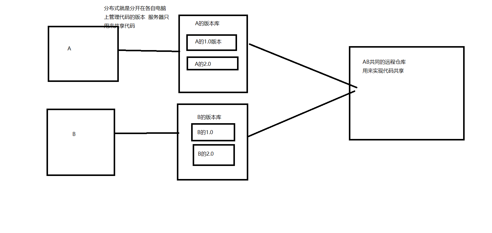

​    

    1. svn 集中式： 集中在一台电脑管理代码版本 别人只要把代码提交给管理源代码的电脑上
    
       https://www.cnblogs.com/0zcl/p/7309766.html svn教程
    
    2. git 分布式的： 分布在每个人电脑上管理每个人的版本 我可以把我的代码提交都服务器 你可以吧代码提交到服务器  服务器 只是做了代码共享 （各自在本地管理各自的代码的版本）

5. git和svn对比 https://www.cnblogs.com/mtl-key/p/6902666.html

        SVN与Git优缺点比较(属面试常问提)
        1．SVN优缺点
        优点： 
        1、 管理方便，逻辑明确，符合一般人思维习惯。 
        2、 易于管理，集中式服务器更能保证安全性。 
        3、 代码一致性非常高。 
        4、 适合开发人数不多的项目开发。 
        缺点： 
        1、 服务器压力太大，数据库容量暴增。 
        2、 如果不能连接到服务器上，基本上不可以工作，看上面第二步，如果服务器不能连接上，就不能提交，还原，对比等等。 
        3、 不适合开源开发（开发人数非常非常多，但是Google app engine就是用svn的）。但是一般集中式管理的有非常明确的权限管理机制（例如分支访问限制），可以实现分层管理，从而很好的解决开发人数众多的问题。
        2．Git优缺点
        优点： 
        1、适合分布式开发，强调个体。 
        2、公共服务器压力和数据量都不会太大。 
        3、速度快、灵活。 
        4、任意两个开发者之间可以很容易的解决冲突。 
        5、离线工作。 
        缺点： 
        1、学习周期相对而言比较长。 
        2、不符合常规思维。 
        3、代码保密性差，一旦开发者把整个库克隆下来就可以完全公开所有代码和版本信息。(以前 私有库要钱 大家都把代码公开 强制开源 现在私有库免费了 你可以不开源)

6. git和github的关系
       git是一个工具用来管理本地代码版本的
       github是一个服务器是用来共享代码的服务器

7. svn和svn服务器 svn 有两个一个是客户端 一个服务端   客户端和服务器软件不一样 需要安装2个软件  在开发人员电脑上安装客户端(把本地代码提交到服务器 和 获取服务器代码更新)   在服务器电脑上安装服务端（创建远程仓库 创建账号 管理权限）    

## 2. git基本使用

### 1. 安装环境  安装git工具软件
    找到git软件 day06 移动web 》的预习资料里面的 》1-教学资料 》Git-2.13.0-64-bit.exe 
    双击打开一路下一步安装
    如果安装完成后 在桌面上右键 有git bash here就表示安装成功

### 2. 了解git的使用流程 怎么管理源代码
    理解git工作流程
    工作区  源代码项目(文件夹)
    暂存区  临时管理源代码(文件夹)  (暂存区的代码 代码的版本还没有完成 先临时放到暂存区里面 等到整个版本的代码都写完 再统一把暂存区的代码提交到本地版本库)
    本地仓库  本地源代码版本的仓库(文件夹) (里面记录了项目的每一个版本 对版本进行操作)
    远程仓库  服务器源代码版本库(文件夹) (用来实现代码仓库共享的远程一个服务器仓库)

## 3. git的使用步骤(git的基本命令的使用)   所有的命令都是在当前项目的git黑窗里面执行 git bash here

​	

1. 在项目中初始化一个本地仓库 git init

    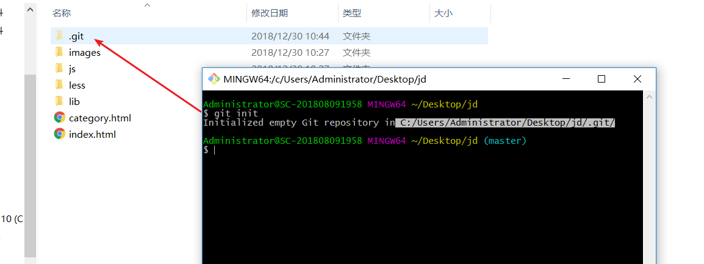

    

2. 把项目需要管理的代码添加到暂存区 git add index.html   或者文件夹 git add images 或者 所有文件 git add .

    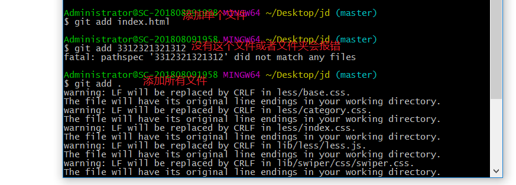

    

3. 查看当前版本库的状态（添加 提交 删除等状态） git status

    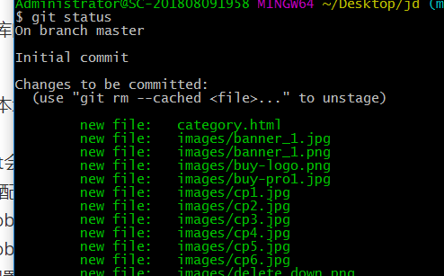

    

4. 把代码提交到本地的仓库 git commit -m '提交日志'  -m是提交说明(日志)的意思 (字符串说明一定要写不写会报错的)    （提交会自动产生一个版本源代码版本）
    第一次commit会报错 原因是没有配置用户名和邮箱 git不知道是谁在提交

    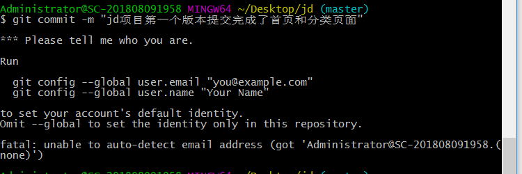

    

    两句命令 一个配置邮箱 一个配置用户名 分别执行
    git config --global user.email "22819715@qq.com"
    git config --global user.name "zwxs"
    --global全局配置的意思  配置了一次以后后不需要在配置 如没有加全局 后面每个项目都需要配置用户和邮箱

    

    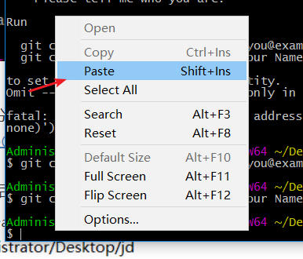

    

    

    

    如果有文件有更新 重新提交 git add .    git commit -m '提交日志'

    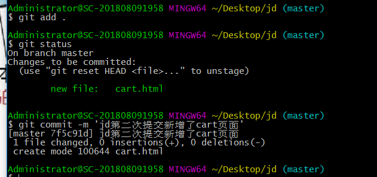

    

5. 查看当前本地仓库所有提交的版本号 git log  

    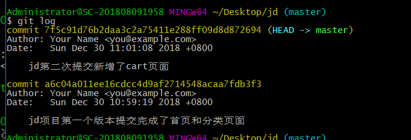

    

6. 如果后面项目源代码有更新  源代码版本也要更新
    git add .  重新把新的代码添加到暂存区
    git commit -m '新的提交日志'  把新的暂存区的代码提交到本地仓库

## 3. git的其他命令
  1. git版本回退
      git reset  --hard HEAD^   回到上一个版本

      

      git reset --hard 0bc1129  回到指定的版本

      

  2. 查看所有版本号
      git reflog  查看所有的版本号

      

  3. git status 查看当前版本库的状态 
      查看当前有哪些文件没有添加到暂存区
      查看当前有哪些文件没有提交到本地仓库

      

  4. git diff 查看当前代码和本地代码的区别
       同一个文件之前本地仓库是什么样子的
       你最新写了什么代码

       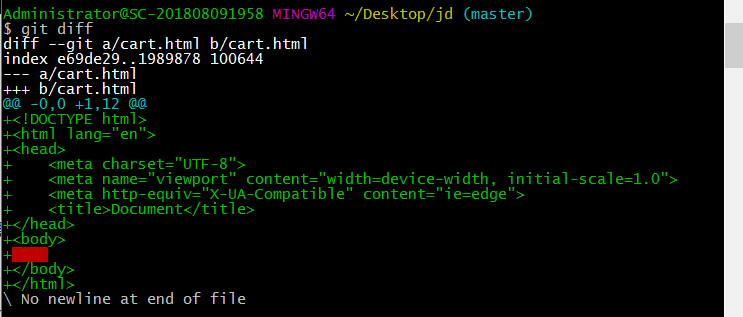

  5. git remote 改变远程地址
      1. 如果设置了一个远程仓库地址 但是不是你想要的
      2. 先删除之前的远程仓库地址 git remote rm origin
      3. 再添加一个新的远程仓库地址  git remote add origin git@github.com:zwxs/jd24.git

  6. git checkout 撤退撤销当前代码的更改
      git checkout -- 指定文件.扩展名

      

  7. git reset HEAD readme.txt 回退add 撤销add
      git add .  但是有个文件不需要加的 单独把这个文件撤销

      git reset HEAD 文件名.扩展名

      

      git checkout -- 指定文件.扩展名

      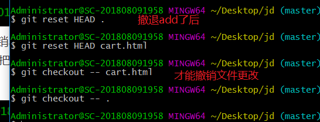

      

## 4. github

1. 是一个git的 远程服务器的提供商 (最好用最有名的) 把你本地仓库的代码共享给别人看 下载等
2. github 可以把你的项目 托管到服务器上 被人可以看到和下载你的代码  作为静态页面的服务器 使用官方的域名实现博客预览等等 可以看到很大大神代码 开源项目 学习最新最前沿的技术  
3. github 提出社交化的编程概念， 可以像看微博 看朋友圈一样看别人代码 点赞 关注等  github就是程序员的新浪微博

## 5. github注册账号

1. 注册步骤： https://www.baidu.com/link?url=zXSuSQZ2b67rZXEwCa5bHquBkTVyPiwieuiEMkfP_AZCiNO6GpnMPG3MOQi7hYTpbVWNCEh7DdgJ6g4wQHht3nKAlzvMptEAdpCaj-seHJW&wd=&eqid=c453f15f000466be000000065bdaa382

## 6. 使用git和github交互

1. 创建一个仓库

   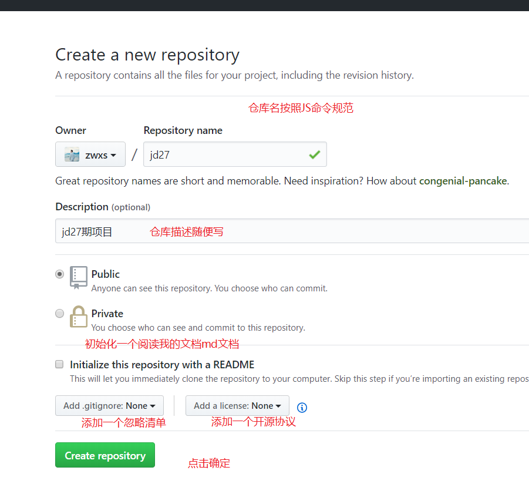

   

   

1. 去github上去创建一个服务器的仓库
    1. 打开github官网 登录 

    2. 点击右上角头像左边的+号

    3. 点击New repository  新建一个本地仓库

    4. 输入Repository name仓库名  不能有中文空格等特殊符号  尽量用纯英文

    5. 输入一个仓库的描述

    6. 选择public

    7. 是否要初始化一个README阅读我 不要勾

    8. 点击创建

       

2. 让本地仓库和远程仓库连接起来 (做一次即可)
    git remote add origin  git@github.com:zwxs/jd23.git  让本地仓库和远程仓库连接 
      git@github.com:zwxs/jd23.git 远程仓库地址 github给你提供的

    

3. 把本地仓库的代码提交到远程的仓库里面
    git push -u origin master  把本地代码提交到远程的master(主)分支里面

    

    

## 把本地电脑和github服务器账号相关联

    1. 使用https 是需要输入用户名和密码的方式  每次都要输入 输错就把提交命令再执行一次 会重新让你输入
    2. 使用SSH  可以让本地电脑和github账号相关联 关联了之后就是永久
        1. 理解原理： 使用一个本地秘钥(电脑的身份证) 把你的本地秘钥和服务器github账号相互绑定  把身份证绑定到服务器账号上
        你每次提交都会读取你当前的本地的秘钥 
        再和你本地仓库管理的github服务器仓库的账号里面的秘钥对应
        如果是一样的就认为github是认可这台电脑的就允许提交
        2. 在本地电脑生成一个秘钥：
          在gitbash黑窗里面执行 ssh-keygen -t rsa -C "228197155@qq.com"
          输入后一路回车 出现2048就表示成功
        3. 秘钥生成后会在C盘 》 用户 》 你的用户(英文或者administor) 》 .ssh 》 id_rsa.pub 
            id_rsa.pub  本地公钥(公开的钥匙) 
            把这个id_rsa.pub 使用记事本打开 把乱码复制一下
        4. 打开github账号
            点击设置
            点击SSH设置
            点击右上角new SSHKey
            输入title(你的名字) key (复制公钥里面的乱码)
            点击Add即可
            出现一个黑色的钥匙就表示成功

## 7. 一个项目从头到尾使用git步骤

    2. 创建一个项目 被管理的项目
    3. 进入项目打开黑窗 输入 git init 初始化
    4. 把要管理的代码添加到暂存区 git add .
    5. 把暂存区代码提交到本地仓库 git commit -m '提交日志'
    6. 要把本地仓库提交到服务器
    7. 创建一个服务器的仓库 new repository
    8. 关联当前本地仓库和远程仓库 git remote add origin git@github.com:zwxs/demo1.git
    9. 把本地仓库代码提交到服务器里面 git push -u orgin master
      如果是第一次提交没有配置SSH秘钥是无法提交 
      1. 黑窗生成一公钥  ssh-keygen -t rsa -C "228197155@qq.com"  把邮箱改成自己的
      2. 复制.ssh 里面的.pub公钥去github绑定
      3. 使用push 把本地仓库代码提交到远程仓库
    10. 如果项目修改 在git add . 把新增修改的代码添加到暂存区
    11. 把新增修改的暂存区代码提交到本地仓库 git commit -m '提交日志'
    12. 把本地仓库代码提交到远程服务器仓库 git push

## 8. 如何去远程下载和更新代码

1. 想要去下载别的项目 或者仓库 找到别人的项目地址

2.  点击右边克隆或者下载 下载他的代码

    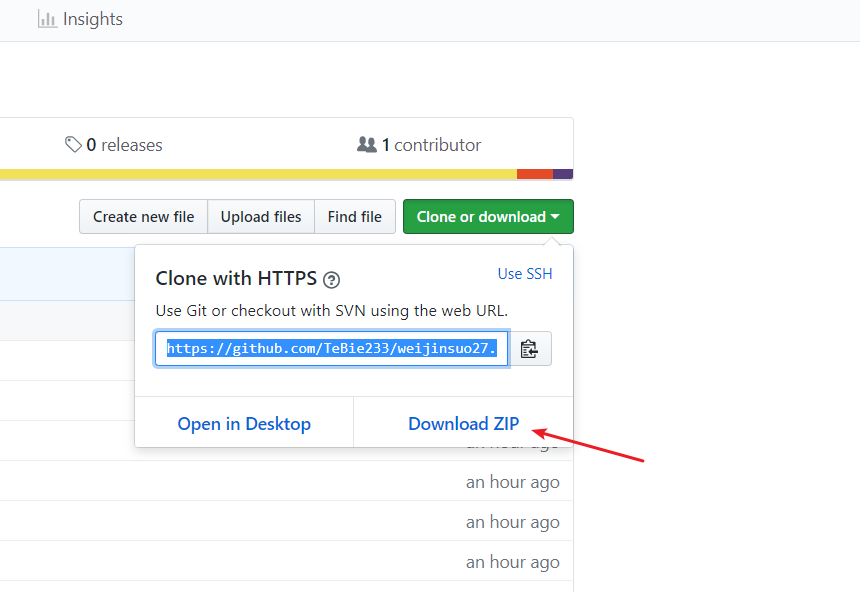

3. 使用命令去克隆别人的仓库

    1. 复制别人远程仓库地址

        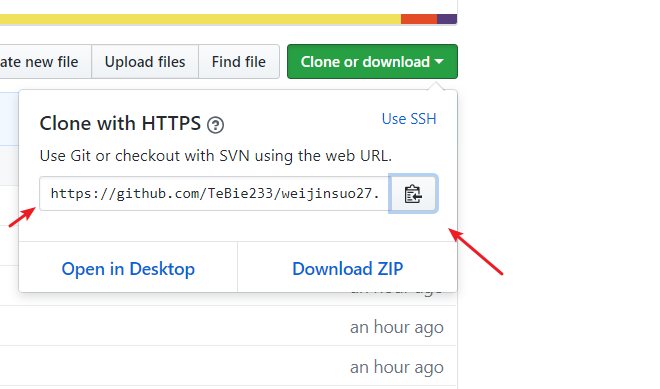

        https://github.com/TeBie233/weijinsuo27.git

    2. 使用git命令去克隆这个仓库

        1. 在桌面打开git bash黑窗

        2. git clone https://github.com/TeBie233/weijinsuo27.git     

        3. 克隆完成后在桌面会创建一个文件夹  和别人项目名一样文件夹

            

            

        4. 你的桌面这个文件夹里面就会有别人代码

## 8. git的分支使用 

  分支的作用：当项目庞大的时候才需要使用分支就把项目细分成很多分支大家在不同分支里面写代码互不影响 
  1. 查看分支 git branch
  2. 创建分支 git branch  分支名  例如   git branch zhangsan
  3. 切换分支 git checkout 分支名 例如  git checkout zhangsan
  4. 合并分支 git merge 分支名  例如  git merge zhangsan   (会把张三分支合并到当前分支如果已经是在张三分支下是没有效果的 只能在非当前分支才能合并这个分支 例如 在主分支里面合并张三的分支)
    5. 提交到远程  git push -u origin 分支名  例如 git push -u origin zhangsan 
    就会把代码提交到远程github的张三分支里面
    6. git分支合并的冲突解决 https://www.cnblogs.com/mengdd/p/3585038.html

## 9. 使用github实现静态页面托管

  1. 把本地静态页面托管到github服务器 让github服务器作为你的服务器 来显示你的页面
  2. 步骤1
      1. 打开github的仓库
      2. 点击代码文件夹左上角 branch master
      3. 在输入框里面输入gh-pages  (分支) 按回车
      4. 打开域名用户名.github.io/仓库名
          zwxs.github.io/jd2
  3. 步骤2
      1. 打开git bash黑窗
      2. 创建一个分支  git branch gh-pages
      3. 查看分支 git branch 查看所有分支
      4. 切换到gh-pages分支 git checkout gh-pages
      5. 把本地的代码提交到远程仓库的gh-pages分支 git push -u origin gh-pages

## 10. 总结

  1. 版本： 软件更新一个编号 1.0  2.0 3.0
  2. 补丁:  大版本出了问题需要维护 产生一个新的版本(小版本)  1.1  1.1.1  1.1.1.1
  3. 版本管理： 版本太多的时候源码也会很多 源代码有多份 管理起来 把每个版本的代码记录下来如果新版本出了问题回到之前的旧版本
  4. 常见的版本管理系统： svn git  vss
  5. 集中式版本管理 分布式版本管理
      1. svn集中式是集中在一台服务器电脑上管理代码的版本 需要联网 对服务器要求高 不开源
      2. git分布式的分布在每个人电脑上去管理版本 版本更新版本回退等都是在本地 服务器只是用来开源项目 多人协作开发使用 不需要联网 对服务器要求不高适合开源项目
  6. git软件 一路下一步安装出现 git bash成功
  7. git基本命令
      1. git init 初始化本地仓库
      2. git add . 添加到暂存区
      3. git commit -m '提交日志' 把代码提交到本地的仓库
      4. git status 查看添加状态
      5. git log 查看提交详细日志
      6. git remote add origin 远程仓库的地址    指定远程仓库地址
      7. git remote rm origin 删除远程仓库的地址
      8. git push -u origin master 把本地代码提交到远程仓库主分支
      9. git reset --hard HEAD^ 回退到上一个版本
      10. git reset --hard 版本号  回退到指定版本
      11. git reflog 查看所有版本号
      12. git diff 查看对比 
      13. git checkout -- 文件 撤销更改
      14. git reset HEAD 文件  撤销add
      15. git branch 分支名  创建一个分支
      16. git checkout 分支名 切换到分支
      17. git merge 分支名  合并分支
      17. git push -u origin 分支 提交到指定的分支
      18. git clone 仓库地址 克隆远程仓库到本地
      19. git pull 把远程代码更新
  8. 静态页面托管
    

## 上午复习

1. 什么是版本管理： 软件都需要更新 每次更新都对应版本的代码 这些代码都需要管理起来  使用文件夹的方式管理复杂麻烦   使用工具来管理源代码
2. 常见有2种版本管理工具
    1. git  linux之父开发的工具用来管理linux系统源代码 后来来源供大家使用
        git分布式的  分开在每个人电脑上管理代码   服务器只共享代码
        灵活方便 离线使用 服务器压力小
        都是使用命令 学习成本高  代码安全性低
    2. svn  也是一个开源的项目 一直都是开源的
        svn是集中式的 集中在服务器上管理源代码 既共享又管理版本
        学习简单 使用图形界面 代码安全性高
        集中式管理服务器压力大 

3. git基本使用
    1. git管理的原理
        1. 使用本地版本库.git来管理源代码  
        2. 有4个区域
            1. 工作区  源代码的文件夹
            2. 暂存区 临时存放当前未完成版本的代码
            3. 本地仓库 里面记录管理版本信息
            4. 远程仓库 共享代码 和 本地仓库同步
        3. 从工作区 把 代码 添加到 暂存区 提交到本地仓库 形成版本 如果有更新 继续添加 再 提交
    2. git常用命令
        1. 初始化仓库 git init
        2. 添加到暂存区 git add .
        3. git status 查看版本库状态
        4. 提交到本地仓库 git commit -m '提交说明'
        5. git log 查看提交详细日志
        6. git reflog 查看所有版本
    3. git其他命令
        1. git reset --hard HEAD^ 回到上一个版本
        2. git reset --hard sfdsfs 回到指定版本
        3. git config  用来做一些配置 用户名 邮箱等

4. git和 github关系和 使用 github
    1. git 是一个软件 管理代码
    2. github 是服务器  用来共享代码 和 分享代码 代码交流圈
    3. 创建github账号
    4. 学会基本使用 

5. git和github的交互

    1. 创建一个远程仓库 点击头像左边的+号 new repository
        输入仓库名称 和项目名称保持一致 不要有中文
        输入仓库描述
        Initialize this repository with a README 不要勾
    2. 让本地仓库和远程仓库进行关联
        git remote add origin 远程仓库的地址
        git remote add origin https://github.com/zwxs/fs.git  https 提交需要输入密码
        git remote add origin git@github.com:zwxs/fs.git  ssh 提交不需要密码(把电脑和账号关联起来)
    3. 使用https 
        git push -u origin master 输入用户名密码 即可提交
    4. 使用ssh
        1. 把电脑和账号关联起来
            1. 创建一个公钥  ssh-keygen -t rsa -C "228197155@qq.com"
            2. 一路回车 在c判断users 的 用户目录下的.ssh文件夹里面  id_rsa.pub
            3. 打开这个id_rsa.pub 文件 复制里面的乱码
            4. 打开github的设置 添加SSHkey
                点击添加 输入名称 和 乱码 确定 出来一个钥匙就是成功
        2. git push -u origin master 不需要输入密码 第一次输入一个yes

6. 回顾git从头到尾使用步骤
    1. 创建一个项目
    2. 进入项目打开git bash黑窗  
    3. 输入git init 初始化一个本地仓库
    4. git add . 把本地代码添加到暂存区
    5. git commit -m '提交日志最好写一个你能理解的'
    6. 第一次commit可能会报错
        配置用户名 git config --global user.name "zwxs"
        配置邮箱 git config --global user.email "22819715@qq.com"
    7. 配置完成后重新执行 commit命令 知道出现create mode表示成功 
    8. 如果代码有更新 再次 git add  .  再次 git commit -m '提交日志'
    9. 创建一个远程仓库
    10. 关联本地和远程仓库
        git remote add origin 远程仓库的地址
        如果关联错了 先删除后关联 git remote rm origin
        再 添加 git remote add origin 远程仓库的地址
    11. 把代码提交到远程 git push -u origin master    -u表示默认值 默认提交到master分支
    12. 如果后续本地仓库有更新
        git add .
        git commit -m '提交日志'
        git push  
7.分支
    1. 一般大项目就会有分支 作用是项目统一 把项目同时的多个版本统一到一起 减少仓库
    2. 查看分支 git branch 
    3. 创建分支 git branch 分支名
    4. 切换分支 git checkout 分支名
    5. 删除分支 git branch -d 分支名
    6. 合并分支 git merge 分支名 -m '合并日志'  合并 当前在哪个分支  就是把merge后面的分支合并到当前分支
        当前在master git merge test  把test合并到master
        当前在test git merge master 把master合并到test
8. 使用分支实现托管静态页面 gh-pages （github官方提供的默认必须是这个分支）
    创建一个gh-pages分支 并且把代码提交到远程的gh-pages分支即可
    访问方式 用户名.github.io/仓库名/页面名
    直接提交到github在远程手动创建分支 打开branch输入gh-pages回车即可
9. 多人合作开发
    1. git clone 仓库的地址 可以把别的项目克隆到你本地
    2. git pull 更新别的的代码  （删除重新克隆）
    3. 推荐每次写代码之前先pull 再写代码 防止冲突
    4. 如果出现冲突 git pull 获取冲突代码 使用vscode 解决 协商需要谁的就使用谁的 解决完后要重新提交

## git基本使用总结

    1. 先有一个项目 项目里面必须有文件(空文件夹不行)  项目根目录打开git bash黑窗
    2. 创建一个本地仓库 有仓库才能管理项目 git init 命令之间都有空格
    3. 把你代码通过仓库来管理 先添加到暂存区  git add .  (每个单词和单词直接 没类符号之间都要有空格)
    4. 查看当前是否添加到暂存区成功 git status  (只能看到暂存区的文件的状态)
    5. 把本地暂存区代码提交到本地仓库 git commit -m '提交说明'  一定要写-m 和 提交说明 说明单双引号都可以
    6. 如果是第一次使用git会报错 
        分别指行配置用户名和配置邮箱
        git config --global user.email "you@example.com"
        执行完后再执行下面的
        git config --global user.name "Your Name"
    7. 配置完成后再次 git commit -m '提交说明' 
    8. 想要查看提交是否成功  git log 查看提交日志
    9. 如果代码有更新 再 add commit    (初始化和配置用户名邮箱只要做一次即可)

## 其他git命令

    1. git status 查看 暂存区的状态
    2. git log 查看日志
    3. git reflog 查看所有版本号
    4. git reset --hard HEAD^ 回退到上一个版本
    5. git reset --hard 指定版本号 回退到指定版本
    6. git diff 查看当前代码和暂存区区别
    7. git checkout -- . 撤销当前代码修改（只是改了代码但是还有add）
    8. git reset HEAD . 撤退add（更改代码已经add了 取消add）只有当撤退了之后 才能
        git checkout -- . 撤销当前代码修改
    9. git remote add origin 远程仓库的地址  把本地仓库和远程仓库进行连接
    10. git remote remove origin 删除之前的连接  （之前设置错了 仓库换了要换仓库也可以这样做）
    11. ssh-keygen -t rsa -C "228197155@qq.com" 生成一个SSH秘钥  把邮箱换成自己的 一路回车出现2048
    12. git push -u origin master 把本地仓库的代码提交到远程仓库  -u默认值 默认提交到远程origin master分支
    13. 如果后面的代码有更新 重新 
    	git add .
        git commit -m '新的提交日志' 
        git push
    14. git clone 仓库的地址 把别人仓库的代码克隆到我本地电脑
    15. git pull  把远程仓库更新的代码 拉取到本地  但是注意要进入当前克隆仓库里面打开黑窗拉取