### 总结

1. 了解项目的架构和目录结构

2. 搭建项目的环境

3. 启动项目

4. 理解项目依赖包和引包顺序

5. 主页的搭建和轮播图组件的使用

6. 主页商品的布局

7. 主页区域滚动插件的使用

8. 分类页面布局和区域滚动插件的使用

   


## 常见网页布局方式和应用场景

1. 固定宽高： 在PC端jd 不考虑屏幕适配的页面  只要保证最小屏幕能够完全看到就可以了
2. 浮动+定位： 
    浮动： 传统没有伸缩布局之前只能使用浮动实现块级元素一行显示   
    定位: 需要定到别的元素上 或者整屏上
3. 百分比布局(流式布局)+浮动： 需要考虑屏幕适配的页面
    1. 早期没伸缩布局 只能使用百分比实现 宽度(只能是宽度)自适应
4. 伸缩布局:宽度自适应  解决以上 块级元素不能一行显示 和 无法自适应屏幕
    1. 伸缩布局   === 浮动 + 百分比
    2. 伸缩布局只能实现宽度自适应
5. rem布局：宽高内容都自适应  解决以上所有问题
    1. rem =  伸缩布局宽度自适应 +  高度也自适应

6. 框架的栅格布局： 响应式布局 同时适配PC 移动端需要使用栅格布局  （对百分比+浮动的一个封装 对百分比+flex的封装）


## 电商全端项目

1. 是一个综合移动端+PC端+node.js后台  (前端(PC+移动)+后端(node.js))    重点是前端
2. 学会移动web切图写页面 + 移动端基本交互 点击滑动之类的交互 + ajax请求数据 渲染模板 + PC切图 + PC 端的交互 + 请求数据渲染模板

## 搭建电商全端项目

1. 安装环境
    1. 安装node.js (用来开启nodejs服务器 提供数据API数据)
        1. 打开移动web第三天 1-教学资料 》 nodejs 找到对应位数的安装包
        2. 双击打开一路下一步安装 不要修改安装目录默认在C盘
        3. 验证是否安装成功 打开cmd  左下角开始菜单右键 》 运行 或者输入win+r 打开运行窗口输入cmd 回车
        4. 输入node -v  出现版本  v10.12.0 表示安装成功
    2. 安装phpstudy  (开启mysql数据库服务器)   没有安装的重新安装一下

2. 启动项目
    1. 下载项目
        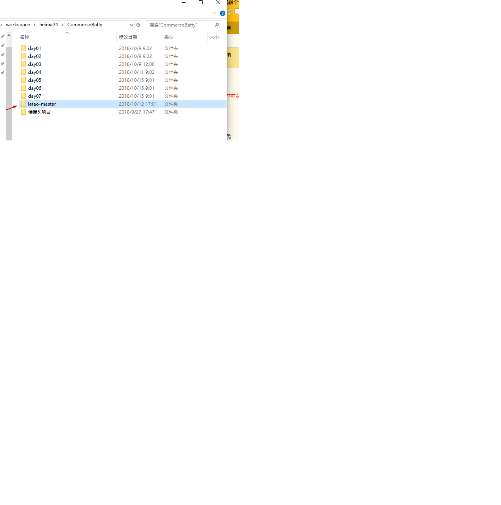
    2. 导入数据库
        1. 找到数据sql文件 
            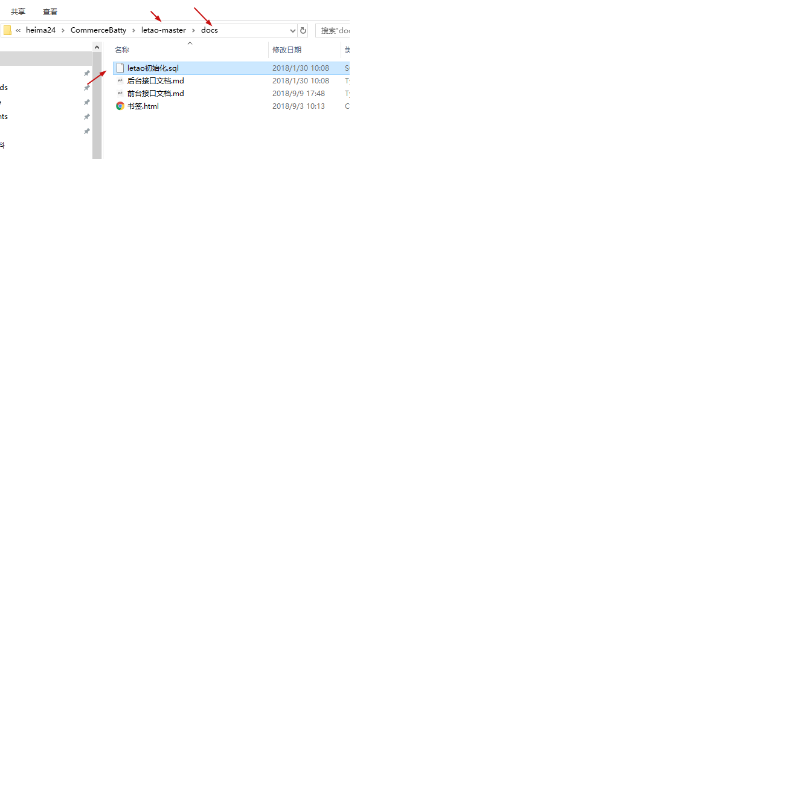
        2. 打开phpstudy 启动数据库
            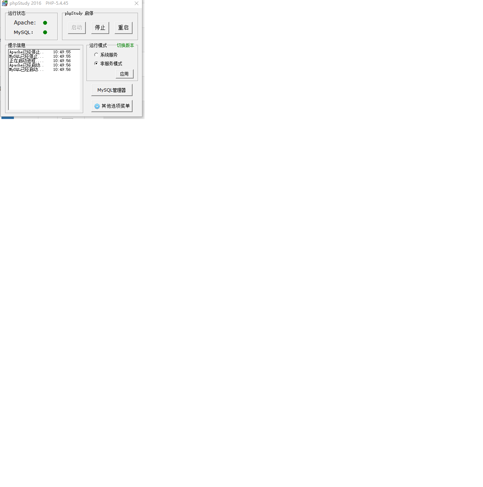
        3. 导入数据库
            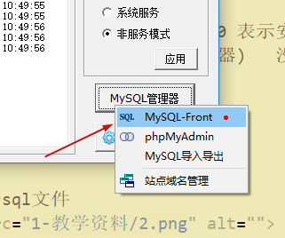
            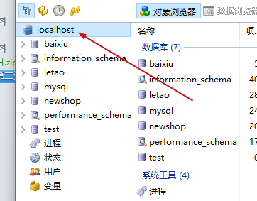
            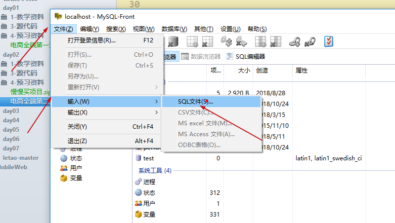
            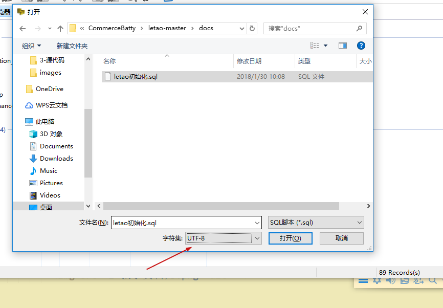
    3. 开启数据库服务器   打开phpstudy 变绿
    4. 开启nodeAPi后台服务器 
        1. 进入letao-master文件夹的根目录
        2. 在空白处 按住shift+鼠标右键 在此处打开命令窗口
        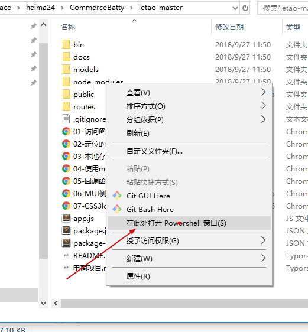
3. 访问项目 
    1. 使用链接的方式访问      
       1. 乐淘完整版移动端 http://localhost:3000/mobile/index.html
       2. 乐淘完整版PC端 http://localhost:3000/manage/login.html
       3. 乐淘自写版移动端 http://localhost:3000/m/index.html
       4. 乐淘自写版PC端  http://localhost:3000/admin/login.html
    2. 使用书签的方式访问页面
        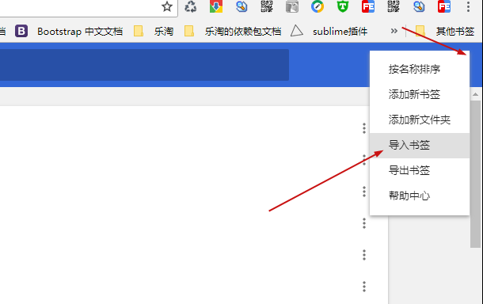
        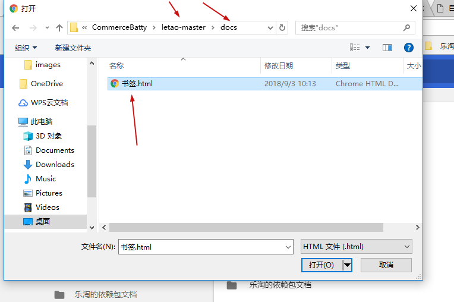
        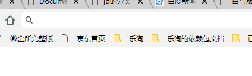
    3. 前端用户名密码 itcast   111111
    4. PC后台管理系统 用户名 root  123456


## 项目架构和项目的文件作用

  1. bin 项目启动目录
  2. docs 项目文档目录
  3. models 数据模型文件 增删改查数据库
  4. node_modules nodejs依赖包文件 类似前端lib
  5. public 前端项目根目录 （页面文件）
  6. routes nodejs APi路由文件  APiurl配置
  7. app.js项目根文件
  8. readme.md说明文档
    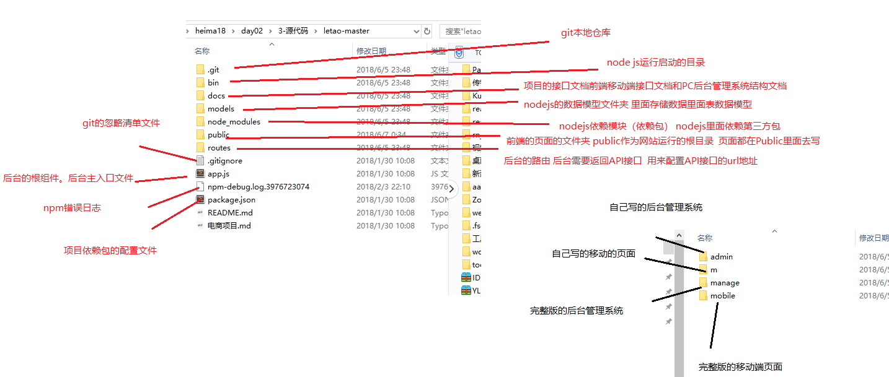

## 前端的项目文件夹public

  1. admin 自己写的PC后台管理系统文件夹
  2. m     自己写的移动端文件夹
  3. manage 完整版的后台管理系统文件夹
  4. mobile 完整版的移动端文件夹
    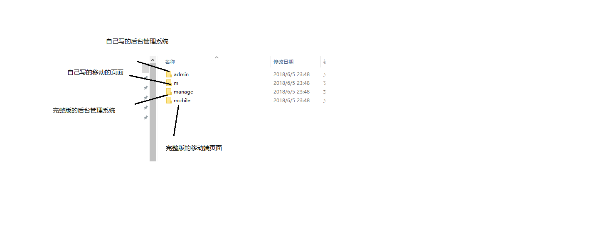
## 如何写前端代码

  1. 把m里面的除了lib和images都删掉
  2. 把admin里面除了lib和images都删掉
  3. 把项目在编辑器打开
      在public 里面的 m文件夹里面 创建一个移动端的主页index.html 然后写点代码
      在public 里面的 admin文件夹里面 创建一个PC端的登录页面login.html 写点代码
  4. 打开书签的自写移动端 和 自己写的PC后台管理系统 看看能不能看到自己写的代码


## 回顾项目启动

  1. 开启数据流库phpstudy  变绿
  2. 进入letao-master文件夹 在根目录打开黑窗  黑窗只能开启一个 执行npm start
  3. 通过书签的方式访问页面（一定要使用书签的链接的方式访问页面）

## 项目的依赖包 

  1. MUI ： 在移动端写页面的UI框架
  2. zepto: 是一个移动端的JS库 操作DOM和发送ajax请求 
  3. artTemplate ： 模板引擎的JS文件  用来渲染模板生成模板
  4. fontawesome ： 字体图标框架  实现页面的字体图标显示
  5. less ： 编译less 
  6. bootstrap: 在PC端用来写页面UI框架
  7. jquery：在PC端写JSDOM操作和发送ajax请求
    在移动端使用 MUI+zepto+fontawesome+arttemplate+less
    在PC端使用 bootstrap+jquery+arttemplate+fontawesome+less


## 项目的搭建

1. 添加视口和引包

    ```html
    <!-- 添加视口 -->
    <meta name="viewport" content="width=device-width, user-scalable=no, initial-scale=1.0, maximum-scale=1.0, minimum-scale=1.0">  
    <title>自己写的乐淘移动端首页</title>
    <!-- 1. 为了实现屏幕适配在最上面先引入rem动态改变根元素字体大小的js -->
    <script src="js/rem.js"></script>
    <!-- 2. 引入MUI的CSS文件 -->
    <link rel="stylesheet" href="lib/mui/css/mui.css">
    <!-- 3. 引入字体图标的CSS文件 -->
    <link rel="stylesheet" href="lib/fontAwesome/css/font-awesome.css">
    <!-- 4. 引入自己主页的less文件 注意rel="stylesheet/less" -->
    <link rel="stylesheet/less" href="less/index.less">
    <!-- 5. 引入less的编译器文件 -->
    <script src="lib/less/less.js"></script>
    <!-- 1. 引入zepto的JS -->
    <script src="lib/zepto/zepto.min.js"></script>
    <!-- 2. 引入MUI的JS文件 -->
    <script src="lib/mui/js/mui.js"></script>
    <!-- 3. 引入模板引擎的JS文件 注意 引入template-web.js-->
    <script src="lib/artTemplate/template-web.js"></script>
    <!-- 4. 引入自己主页的js文件 -->
    <script src="js/index.js"></script>
    ```

    

2. 写页面结构

      ```html
      <!-- 头部区域 -->
      <header id="header">
      </header>
      <!-- 中间的主体区域 -->
      <main id="main">
        <!-- 轮播图区域 -->
        <section id="slide"></section>
        <!-- 导航区域 -->
        <nav id="nav"></nav>
        <!-- 广告区域 -->
        <section id="banner"></section>
        <!-- 品牌专区 -->
        <section id="brand"></section>
        <!-- 运动生活专区 -->
        <section id="sport"></section>
        <!-- 女士专区 -->
        <section id="women"></section>
        <!-- 男士专区 -->
        <section id="men"></section>  
      </main>
      <!-- 底部区域 -->
      <footer id="footer">
      
      </footer>
      ```

      

3. 实现头部的布局

4. 实现广告 和 专区的栅格布局

## 主页的内容滚动效果实现

1. 学会使用MUI的区域滚动插件  http://dev.dcloud.net.cn/mui/ui/#scroll
2. 使用方式
    1. 引包
    2. 写结构 

        ```html
        <!-- 中间的主体区域 -->
        <main id="main">
            <div class="mui-scroll-wrapper">
              <div class="mui-scroll">
                <!--这里放置真实显示的DOM内容-->
                <!-- 轮播图等要滑动的内容 -->
              </div>
            </div>   
        </main> 
        ```

        ​    
    3. 初始化区域滚动插件

        ```js
        mui('.mui-scroll-wrapper').scroll({
          deceleration: 0.0005 //flick 减速系数，系数越大，滚动速度越慢，滚动距离越小，默认值0.0006
        });
        ```

    4. 修改样式
        1. 给区域滚动外面main添加一个相对定位让区域滚动参照父元素相对定位而不是body

          ```html
          <!-- 中间的主体区域 -->
          <main id="main">
              <div class="mui-scroll-wrapper">
                <div class="mui-scroll">
                  <!--这里放置真实显示的DOM内容-->
                  <!-- 轮播图等要滑动的内容 -->
                </div>
              </div>   
          </main>
          ```

        2. 由于设置了相对定位 但是里面区域滚动是绝对定位脱标导致父元素没有高度 所以还需要添加一个高度100%继承body 和 html的高度

          ```less
          /* 给body设置padding 让 main被挤到中间来 */
          
          body {
              padding: .45rem 0;
              /* 给body设置高度 100vh */
              height: 100vh;
          }
          /* 让main高度也是100% 跟body的内容一样高 */
          
          /* 中间部分的主体样式 */
          
          #main {
              /* 会在main里面添加一个区域滚动容器 MUI自带了绝对定位 可以main设置相对定位 让 mui-scroll-wrapper相对main去定位 */
              position: relative;
              /* 同时需要给main设置高度100% 让main在中间范围显示 继承body内容的高度 */
              height: 100%;
          }
          ```

          
## 分类页面的布局

1. 头部的左中右布局

    ```html
    <!-- 头部区域 -->
    <header id="header">
        <a href="#" class="left fa fa-arrow-left"></a>
        <form action="#" class="center">
            <input type="search" placeholder="请输入要搜素的内容">
        </form>
        <a href="search.html" class="right fa fa-search"></a>
    </header>
    ```

2. 分类头部输入框样式修改

    ```less
    input {
        /* 去掉输入框默认底部margin */
        margin-bottom: 0;
        background-color: #fff;
        /* 把输入框的文字颜色改成黑色 */
        color: #000;
        /* 默认重复覆盖文字居左 */
        text-align: left;
    }
    ```

    

3. 中间的左右布局

    ```html
    <!-- 主体区域 -->
    <main id="main">
        <div class="category-left">      
            <ul>
                <li class="active"><a href="#">运动馆</a></li>
                <li><a href="#">女士馆</a></li>
                <li><a href="#">男士馆</a></li>
                <li><a href="#">生活馆</a></li>
                <li><a href="#">单身馆</a></li>
            </ul>     
        </div>
        <div class="category-right">        
            <!-- mui-row是真实滚动内容 放到mui-scroll容器里面 -->
            <!--这里放置真实显示的DOM内容-->
            <div class="mui-row">
                <!-- .mui-col-xs-4*6>a[href="#"]>img[src="images/brand$.png"]+p{耐克$} -->                                             
            </div>           
    </div>    
    </main>
    ```

4. 分类的左右布局样式修改
    ```less
    /* 分类页面的主体样式 */
    #main{
        display: flex;
        background-color: #ccc;
        .category-left{
            width: .8rem;
            position: relative;
            height: 100%;
            .mui-scroll{
                min-height: 100.5%;
            }
            ul{
                li{
                    a{
                        display: block;
                        height: .45rem;
                        line-height: .45rem;
                        text-align: center;
                        background-color: #fff;
                        border-bottom: 1px solid #ccc;
                        &:active{
                            color:#666;
                        }
                    }
                    &.active{
                        a{
                            background-color: #ccc;
                        }
                    }
                }
            }
        }
        .category-right{
            flex: 1;
            /* 里面子元素绝对定位 设置定位值 不会受到父元素padding去影响 */
            /* padding: .1rem; */
            position: relative;
            height: 100%;
            .mui-scroll{
                min-height: 100.5%;
            }
            .mui-row{
                /* 因为外面元素定位 padding给right加没用 只能给row加让里面的列居中 */
                padding: .1rem;
                a{
                    display: block;
                    background-color: #fff;
                    text-align: center;
                    padding-bottom: .05rem;
                    margin-bottom: .1rem;
                    img{
                        width: 100%;
                    }
                }
            }
        }
    }
    ```

5. 分类左右的区域滚动

    1. 分别给左侧分类和右侧分类添加区域滚动的容器结构
    2. 修改分类左侧右侧的样式让区域滚动相对分类左侧右侧去定位
    3. 分类右侧padding 对绝对定位子元素无效需要 给mui-row设置
    4. 如果内容不够想强行加高度可以设置 mui-scroll 最小高min-height

      ​        


## 复习

1. 乐淘项目架构： 
    1. 前后端不分离的项目 前端后端代码都在一个文件夹letao-master
    2. 前端（移动端+PC端）  后端(nodejs) + 数据库
    3. 前端是public里面的  除了public其他都是 nodejs后端

2. 项目的环境搭建和启动
    1. 安装node.js 一路下一步
    2. 安装mysql 安装phpstudy即可 
    3. 导入数据 把letao-master里面的docs  里面的letao初始化.sql导入数据库 UTF-8编码问题
    4. 启动
        1. 开启数据库
        2. 开启nodejs黑窗  
        3. 进入letao-master根目录按住shift+右键  在此处打开命令窗口 powershell 窗口
        4. 输入npm start 回车 没有报错就表示成功
        5. 黑窗和数据库都不要关闭 黑窗只有能一个
            如果开启多个回车 报错 Port 3000 is already in use   3000端口被占用
            全部关闭再开一个（把node.js进程关闭）
3. 写前端代码
    1. 在public 前端目录
    2. m 自写移动端
    3. admin 自写的PC端
    4. mobile 完整移动端
    5. manage完整的PC端
    6. 在m里面 和 admin里面写代码 把 除了lib 和 images之外的都删掉
    7. 访问方式
        1. 使用链接访问
             1. 乐淘完整版移动端 http://localhost:3000/mobile/index.html
             2. 乐淘完整版PC端 http://localhost:3000/manage/login.html
             3. 乐淘自写版移动端 http://localhost:3000/m/index.html
             4. 乐淘自写版PC端  http://localhost:3000/admin/login.html
        2. 使用书签的方式访问
            1. 导入书签 点击书签的链接
4. 写移动端首页
    1. 引包 移动端需要MUI + fontawesome + zepto + arttemplate + less
        1. 先引入第三方CSS
        2. 在引入自己的CSS
        3. 如果有依赖先引入依赖 在引入不依赖的
        4. JS放后面引入(一些特殊的JS除外)
    2. 搭建首页布局
          写结构
          头部
          主体
            轮播图
            导航条
            广告
            品牌
            运动
            女士
            男士 
          底部
    3. 实现头部布局
        1. 使用rem单位 把页面所有px使用rem 
        2. 默认以1rem = 100px作为标准 设置根元素字体大小 默认 100px
        3. 写代码的时候把一些px单位 / 100  例如 45px   0.45rem
        4. 使用 fontawesome图标 让图标定位在右边
    4. 导航条 使用栅格布局
    5. 广告使用栅格布局
    6. 各种专区 栅格布局
    7. 首页的区域滚动效果
        1. 给页面body容器固定高度 100vh 设置伸缩布局
        2. 头部底部高度固定 45  中间main  flex:1 自适应 但是要注意给main设置overflow:hidden;
        3. 给main设置相对定位 里面的区域滚动父容器设置绝对定位 父元素一定要相对定位
        4. 添加区域滚动的父容器 和 子容器

            ```html
            <div class="mui-scroll-wrapper">
                <div class="mui-scroll">
                    真实的内容 轮播图 导航条等
                </div>
            </div>
            ```

        5. 使用JS初始化区域滚动 （查看官网文档）
    8. 分类页面布局
        上
        左 中 右  flex布局
        中
        左侧分类
        右侧分类
        flex伸缩布局
        下
    9. 分类页面的功能
        1. 左侧 和右侧分类的滑动

        2. 加一个区域滚动

            ```html
            <div class="mui-scroll-wrapper">
                <div class="mui-scroll">
                    <ul>真实ul内容</ul>
                </div>
            </div>
            ```

        3. 设置样式
            给父元素设置相对定位

            ```
             .category-left{
                    width: .8rem;
                    /* 里面设置区域滚动 一定要给父元素设置相对定位 让区域滚动相对left 或者 right来定位 */
                    position: relative;
                    .mui-table-view-cell:after{
                        left: 0;
                    }
                }
                .category-right{
                    flex: 1;
                    /* padding: 10px; */
                    position: relative;
                  
                }
            ```

            

        4. 初始化区域滚动

            ```
            // 由于区域滚动默认也是没有初始化需要手动初始化
                mui('.mui-scroll-wrapper').scroll({
                    indicators: true, //是否显示滚动条
                    deceleration: 0.0005 //flick 减速系数，系数越大，滚动速度越慢，滚动距离越小，默认值0.0006
                });
            ```

            

        5. 右侧分类padding不会影响到定位元素的  给里面mui-row设置padding

            ```
            .mui-row{
                // 给里面的MUI-row加padding
                /* 因为mui-row里面的子元素没有绝对定位 */
                padding: .1rem;
             }
            ```

            